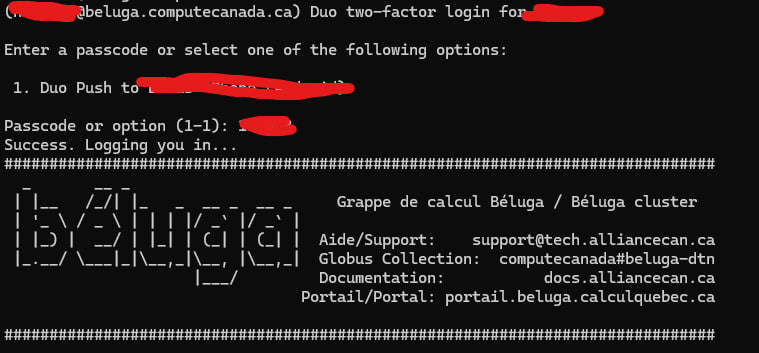

# How to Setup DRAC

## Initial Setup
### 1. Get account details
Go to https://ccdb.alliancecan.ca/ and setup an account. Once approved, you will receive an email.
Save the username and password used to create the account. You will need this to login into the server.

### 2. SSH Into Server
Open a command window and run the following command:
```
ssh -Y <username>@beluga.computecanada.ca
```

The first time you login, you will be prompted to setup MFA.
Follow the instructions and connect your phone to setup MFA.
If done properly, you should see the following screen:


### 3. Clone the repository
First, navigate to the directory where you want to clone the repository.

```
cd projects/def-mcapretz/<your_username>
```

Clone the repository using the following command:
```
git clone https://github.com/LucasHartmanWestern/rl-for-vrp-csp.git
```


### 4. Create a virtual environment
Go to home directory using the following command:
```
cd ~
```

Create a new directory for environments:
```
mkdir envs/
```

Go to the newly created directory:
```
cd envs
```

Load the version of python that you want to use:
```
module load python/3.10
```

Create a new virtual environment:
```
virtualenv --no-download merl_env
```

Activate the virtual environment:
```
source merl_env/bin/activate
```

Upgrade pip:
```
pip install --no-index --upgrade pip
```

### 5. Install the dependencies
Go to the github repository:
```
cd ~/projects/def-mcapretz/<your_username>/rl-for-vrp-csp
```

Install pytorch separately:
```
pip install --no-index torch torchvision torchaudio torchtext
```

Run the following command to install the remaining dependencies:
```
pip install -r requirements.txt --no-index
```
If any errors occur, try installing the dependencies manually using the following command:
```
pip install <package_name>
```

Re-run the installataion command with no-index set and make sure no errors occur.

## (Optional) Setting up SSH Keys for easier access
Ref: https://docs.alliancecan.ca/wiki/SSH_Keys

### 1. Generate an SSH key
Assuming ssh-keygen is already installed, use the following command to generate an SSH key:
```
ssh-keygen -t rsa -b 4096 -C "<your_email>"
```

### 2. Add the SSH key to your ccdb account
Go to https://ccdb.computecanada.ca/ssh_authorized_keys and login with your CCDB credentials.
Paste the contents of the SSH key into the text box and click "Add Key".

### 3. Configure private key locally
In your .ssh folder, create a new file called config and add the following:
```
Host beluga
    HostName beluga.computecanada.ca
    User <your_username>
    IdentityFile ~/.ssh/<your_private_key>
```

### 4. Test the SSH connection
Run the following command to test the SSH connection:
```
ssh beluga
```


## Running Experiments

### 1. Generate the job scripts
Run the following command to generate the job scripts:
```
python generate_jobs.py -e <experiment_number>
```
You can also generate the job scripts for all experiments by passing "all" as the argument:
```
python generate_jobs.py -e all
```

### 2. Submit the jobs
Run the following command to submit the jobs to the DRAC queue:
```
sbatch experiments/Exp_<experiment_number>/train_job.sh
```

Make sure this command is run within the DRAC server.

### 3. Monitor the jobs
You can monitor the jobs by running the following command:
```
sq
```

## Retrieving the results using SCP

### 1. Navigate to desired source directory
On the Huron server, the results should be stored in storage_1/metrics/.
```
cd ~
cd ../../storage_1/metrics
```

### 2. Retrieve metrics data
Use the following command to copy the results from DRAC to the current directory:
```
rsync -av --no-perms --prune-empty-dirs \
  --include='*/' \
  --include='Exp_*/train/**' \
  --exclude='*' \
  <your_username>@beluga.computecanada.ca:/lustre04/scratch/<your_username>/metrics/ .
```

### 3. Delete empty directories (optional)
Use the below command if you want to delete empty directories after the transfer:
```
ssh <your_username>@beluga.computecanada.ca 'find /lustre04/scratch/<your_username>/metrics/ -type d -empty -delete'
```

### 4. Retrieve saved models
Use the following command to copy the saved models from DRAC to the current directory:
```
rsync -av --ignore-existing --remove-source-files <your_username>@beluga.computecanada.ca:projects/def-mcapretz/<your_username>/rl-for-vrp-csp/saved_networks/ ./
```
Note that when using the above command, the files on DRAC that were copied will be deleted, and files that already exist on the lab server will not be copied from the DRAC server.

### 5. Delete empty model directories (optional)
Use the below command if you want to delete empty directories after the transfer:
```
ssh <your_username>@beluga.computecanada.ca 'find projects/def-mcapretz/<your_username>/rl-for-vrp-csp/saved_networks/ -type d -empty -delete'
```

### 6. Retrieve job stats:
Load the SLURM module:
```
module load slurm
```

Load into the relevant directory:
```
cd ~
cd scratch/metrics/Exp_<experiment_number>/train
```

Retrieve the job stats:
```
sstat -j <job_id> --format=All --delimiter='|' > job_<job_id>_sstat.txt
```

Clean the file:
```
python clean_stats.py -rd <directory_containing_the_file>
```
