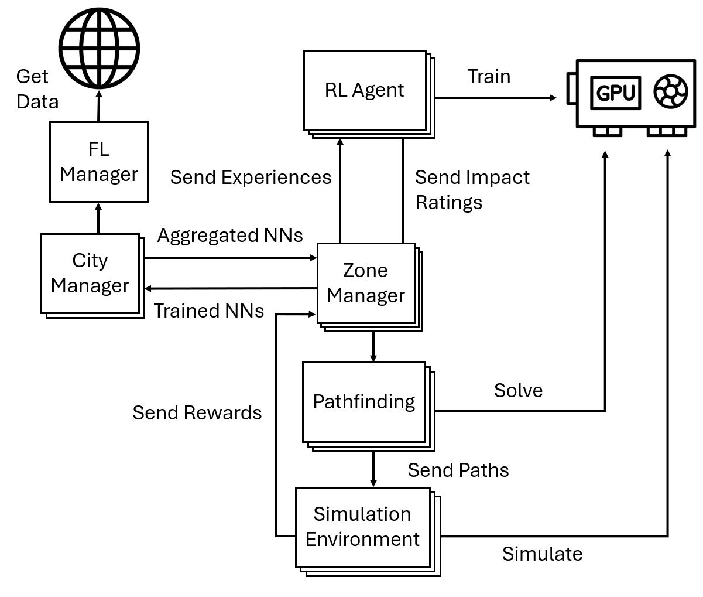

# MERL: Multi-factor Edge-weighting with Reinforcement Learning for EV Routing

## Overview

With Electric Vehicle (EV) adoption rates continuing
to grow, it is becoming increasingly critical to find solutions
to mitigate the risk of overloading the electrical grid. This
paper examines the effectiveness of an EV routing application
powered by an enhanced version of the Multi-factor Edge-weighting
with Reinforcement Learning (MERL) algorithm, which
uses federated learning to significantly increase performance,
provide added security measures, and improve the sustainability
of the algorithm. The application is designed to optimize EV
routing by minimizing traffic clustering and travel duration. The
application combines real-time data on traffic patterns, charging
station availability, and grid load to direct drivers efficiently,
aiming to alleviate congestion and balance grid demands. Our
findings demonstrate that this advanced algorithmic approach
significantly reduces peak charging station loads and enhances
electrical grid efficiency. This study highlights the potential of
merging sophisticated algorithms with practical applications to
mitigate the challenges of urban EV integration, marking a
pivotal step towards sustainable urban mobility.

## Authors

- Lucas Hartman ([lhartma8@uwo.ca](mailto:lhartma8@uwo.ca))
- Santiago Gomez-Rosero ([sgomezro@uwo.ca](mailto:sgomezro@uwo.ca))
- Ethan Pigou ([epigou@uwo.ca](mailto:epigou@uwo.ca))
- Miriam A. M. Capretz ([mcapretz@uwo.ca](mailto:mcapretz@uwo.ca))

Department of Electrical and Computer Engineering, Western University, London, Ontario, Canada, N6A 5B9


## Installation

1. Clone the repository:
    ```sh
    git clone https://github.com/LucasHartmanWestern/rl-for-vrp-csp.git
    cd rl-for-vrp-csp
    ```

2. Create and activate a virtual environment (optional but recommended):
    ```sh
    python3 -m venv venv
    source venv/bin/activate
    ```

3. Install the required dependencies:
    ```sh
    pip install -r requirements.txt
    ```

## Configuration

- **Environment Configuration**: `environment_config.yaml` contains parameters for the custom environment.
- **Agent Configuration**: `neural_network_config.yaml` contains hyperparameters for the reinforcement learning agent.
- **Algorithm Configuration**: `algorithm_config.yaml` contains algorithm to use.
- **Evaluation Configuration**: `evaluation_config.yaml` contains values to change how much information is displayed during training.

## Usage

### Training the Model

Run the main script to train the reinforcement learning agent using federated learning:
```sh
python app.py
```

### Evaluating the Model

Evaluate the trained models created:
```sh
python ?.py
```

## Diagrams
### Process Diagram

